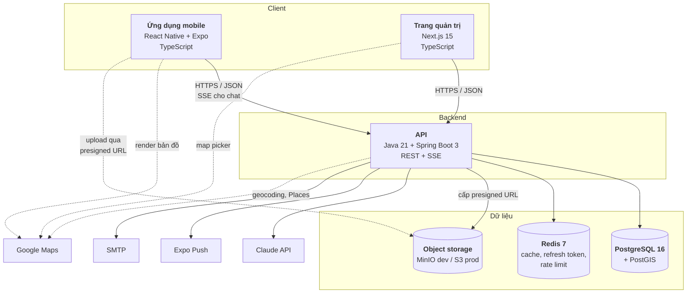

# C4 — Mức 2: Container

Các khối triển khai được bên trong FoodMap và cách chúng nói chuyện với nhau.

## Từng container

### Ứng dụng mobile — React Native + Expo

Client chính cho người dùng cuối, chạy iOS và Android từ một codebase.
Điều hướng bằng expo-router; state server bằng TanStack Query; state client bằng zustand;
bản đồ bằng `react-native-maps` với provider Google trên cả hai nền tảng.

Gọi API qua TypeScript client **sinh tự động** từ `openapi.yaml`. Upload media
**không** đi qua backend mà lên thẳng object storage bằng presigned URL.

### Trang quản trị — Next.js 15

Dành cho MODERATOR và ADMIN. App Router, ưu tiên Server Component. UI dùng shadcn/ui.
Dùng chung JWT với mobile và cũng dùng TypeScript client sinh từ cùng `openapi.yaml`.

### API — Spring Boot 3

Container duy nhất chứa logic nghiệp vụ. Tổ chức package-by-feature. Trách nhiệm:

- Xác thực JWT và phân quyền (chặn thật ở đây, không dựa vào giao diện)
- Truy vấn địa lý qua PostGIS
- Vòng đời kiểm duyệt review và feedback
- Cấp presigned URL, xác minh file sau upload
- Điều phối hội thoại chatbot, gồm cả các tool mà mô hình gọi ngược
- Gửi thông báo và email

Phơi REST cho hầu hết endpoint và **SSE** riêng cho chat để stream câu trả lời.

### PostgreSQL 16 + PostGIS

Nguồn sự thật của toàn bộ dữ liệu nghiệp vụ. Toạ độ lưu bằng `geography(Point, 4326)`
với index GiST — đây là lý do chọn PostGIS thay vì tự tính khoảng cách ở tầng ứng dụng.
Lược đồ do Flyway quản lý.

### Redis 7

- Refresh token (để thu hồi được)
- Cache kết quả tìm quanh đây trong thời gian ngắn
- Bộ đếm rate limit
- Hàng đợi thông báo bị hoãn qua đêm (FR-NOTIF-05)

Redis chết thì app vẫn chạy được nhưng chậm hơn và mất khả năng thu hồi token sớm.

### Object storage

MinIO ở dev, S3 ở prod — cùng API nên đổi môi trường chỉ cần đổi endpoint.
Lưu ảnh gốc, thumbnail 400px, bản hiển thị 1600px, và video.

## Luồng dữ liệu đáng chú ý

**Tìm quanh đây**
`mobile → API → PostGIS (ST_DWithin + index GiST) → API → mobile`.
Google Maps chỉ dùng để *vẽ* bản đồ; việc *tìm* hoàn toàn nằm ở PostGIS.

**Upload media**
`mobile → API (xin presigned URL) → mobile → object storage (upload thẳng) → API (báo xong, xác minh file)`.
File không bao giờ đi qua backend — tránh nghẽn băng thông và bộ nhớ.

**Chatbot**
`mobile → API → Claude API → (tool call) → API → PostGIS → API → Claude API → SSE stream → mobile`.
Mô hình không truy cập CSDL trực tiếp; nó gọi tool do backend đăng ký, backend mới truy vấn.

## Ranh giới quan trọng

- **Hợp đồng API là `openapi.yaml`**, không phải code. Cả ba phía đều bám vào file đó.
- **Phân quyền chỉ có hiệu lực ở API.** Mobile và admin ẩn nút cho gọn giao diện,
  nhưng đó không phải biện pháp bảo vệ (NFR-13).
- **Client không nói chuyện trực tiếp với Claude API.** Khoá API chỉ nằm ở backend.
