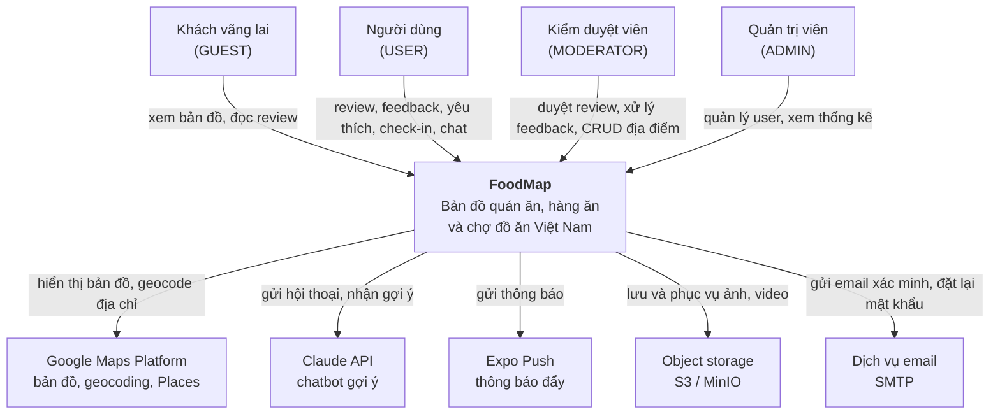

# C4 — Mức 1: Bối cảnh hệ thống

Ai dùng FoodMap và FoodMap nói chuyện với hệ thống ngoài nào.

## Tác nhân

| Tác nhân | Dùng gì | Mục đích |
|---|---|---|
| GUEST | App mobile | Xem bản đồ và review công khai, chưa cần tài khoản |
| USER | App mobile | Review, feedback, yêu thích, ghi lượt đến, hỏi chatbot |
| MODERATOR | Trang quản trị | Duyệt review, xử lý feedback, CRUD địa điểm và danh mục |
| ADMIN | Trang quản trị | Toàn quyền, thêm quản lý user và xem thống kê |

## Hệ thống ngoài

| Hệ thống | Dùng để làm gì | Điều gì xảy ra nếu nó chết |
|---|---|---|
| **Google Maps Platform** | Render bản đồ trên mobile; geocode địa chỉ khi admin nhập địa điểm; Places API để seed dữ liệu ban đầu | Bản đồ không hiển thị. Danh sách và tìm kiếm vẫn chạy (truy vấn địa lý do PostGIS đảm nhiệm, không phụ thuộc Google). |
| **Claude API** | Chatbot gợi ý địa điểm, có tool gọi ngược vào API nội bộ | Chỉ tính năng chat ngừng hoạt động. Hiển thị thông báo thân thiện, phần còn lại của app bình thường. |
| **Expo Push** | Gửi thông báo đẩy tới iOS và Android | Push không tới. Thông báo in-app vẫn được tạo và người dùng vẫn thấy khi mở app (FR-NOTIF-01). |
| **Object storage** | Lưu ảnh và video review; client upload thẳng qua presigned URL | Không upload và không xem được ảnh mới. Text của review vẫn hoạt động. |
| **SMTP** | Email xác minh tài khoản và đặt lại mật khẩu | Không đăng ký mới và không đặt lại mật khẩu được. Người đã đăng nhập không bị ảnh hưởng. |

**Nguyên tắc:** không hệ thống ngoài nào được phép làm sập toàn bộ ứng dụng.
Mỗi tích hợp phải có đường suy giảm (degradation) rõ ràng như bảng trên.

Chi tiết bên trong: [C4 mức 2 — Container](./c4-container.md).
