# Lược đồ dữ liệu (ERD)

Nguồn sự thật của lược đồ là các file migration Flyway trong
`backend/src/main/resources/db/migration/`. Tài liệu này mô tả **ý định**; khi hai bên
lệch nhau thì migration đúng, và tài liệu này phải được cập nhật.

Quy ước đặt tên, kiểu dữ liệu và index: xem skill `db-migration` ở repo cha.
Chi tiết từng cột: [`data-dictionary.md`](./data-dictionary.md).
Phần địa lý: [`geo-model.md`](./geo-model.md).

---

## Sơ đồ

```mermaid
erDiagram
    users ||--o{ reviews : viet
    users ||--o{ feedbacks : gui
    users ||--o{ favorites : luu
    users ||--o{ visits : ghi_nhan
    users ||--o{ notifications : nhan
    users ||--o{ push_tokens : dang_ky
    users ||--o{ refresh_tokens : so_huu
    users ||--o{ chat_sessions : tao

    places ||--o{ reviews : co
    places ||--o{ feedbacks : bi_bao
    places ||--o{ favorites : duoc_luu
    places ||--o{ visits : duoc_den
    places ||--o{ opening_hours : co
    places ||--o{ place_translations : dich
    places ||--o{ place_media : co_anh
    places }o--o{ categories : thuoc

    categories ||--o{ category_translations : dich

    reviews ||--o{ review_media : dinh_kem

    chat_sessions ||--o{ chat_messages : chua

    users {
        uuid id PK
        varchar email UK
        varchar password_hash
        varchar display_name
        varchar avatar_url
        varchar role
        varchar preferred_locale
        boolean email_verified
        timestamptz created_at
        timestamptz updated_at
        timestamptz deleted_at
    }

    places {
        uuid id PK
        varchar slug UK
        varchar place_type
        geography location
        varchar address
        varchar phone
        varchar status
        boolean needs_review
        numeric average_rating
        int review_count
        bigint visit_count
        bigint distinct_visitor_count
        uuid created_by FK
        timestamptz created_at
        timestamptz updated_at
        timestamptz deleted_at
    }

    place_translations {
        uuid id PK
        uuid place_id FK
        varchar locale
        varchar name
        text description
    }

    categories {
        uuid id PK
        varchar slug UK
        varchar icon
        int display_order
    }

    category_translations {
        uuid id PK
        uuid category_id FK
        varchar locale
        varchar name
    }

    place_categories {
        uuid place_id FK
        uuid category_id FK
    }

    opening_hours {
        uuid id PK
        uuid place_id FK
        smallint day_of_week
        time open_time
        time close_time
        boolean is_closed_all_day
    }

    reviews {
        uuid id PK
        uuid place_id FK
        uuid user_id FK
        smallint rating
        text content
        varchar locale
        varchar status
        text moderation_note
        uuid moderated_by FK
        timestamptz moderated_at
        timestamptz created_at
        timestamptz updated_at
        timestamptz deleted_at
    }

    review_media {
        uuid id PK
        uuid review_id FK
        varchar media_type
        varchar storage_key
        varchar thumbnail_key
        int width
        int height
        int duration_seconds
        bigint size_bytes
        int display_order
    }

    place_media {
        uuid id PK
        uuid place_id FK
        varchar storage_key
        varchar thumbnail_key
        boolean is_cover
        int display_order
    }

    feedbacks {
        uuid id PK
        uuid place_id FK
        uuid user_id FK
        varchar type
        text description
        uuid duplicate_of_place_id FK
        varchar status
        text resolution_note
        uuid resolved_by FK
        timestamptz resolved_at
        timestamptz created_at
    }

    favorites {
        uuid id PK
        uuid user_id FK
        uuid place_id FK
        timestamptz created_at
    }

    visits {
        uuid id PK
        uuid user_id FK
        uuid place_id FK
        date visit_date
        geography recorded_location
        int distance_meters
        timestamptz created_at
    }

    notifications {
        uuid id PK
        uuid user_id FK
        varchar type
        varchar title_key
        jsonb payload
        boolean is_read
        timestamptz push_sent_at
        timestamptz created_at
    }

    push_tokens {
        uuid id PK
        uuid user_id FK
        varchar token UK
        varchar platform
        timestamptz last_used_at
    }

    refresh_tokens {
        uuid id PK
        uuid user_id FK
        varchar token_hash UK
        timestamptz expires_at
        timestamptz revoked_at
    }

    chat_sessions {
        uuid id PK
        uuid user_id FK
        timestamptz created_at
    }

    chat_messages {
        uuid id PK
        uuid chat_session_id FK
        varchar role
        text content
        jsonb referenced_place_ids
        timestamptz created_at
    }

    audit_logs {
        uuid id PK
        uuid actor_id FK
        varchar action
        varchar entity_type
        uuid entity_id
        jsonb before_state
        jsonb after_state
        text note
        timestamptz created_at
    }
```

---

## Các cụm bảng

### Người dùng và phiên
`users` · `refresh_tokens` · `push_tokens`

`refresh_tokens` lưu **hash** của token, không lưu token gốc. Cột `revoked_at` phục vụ
cơ chế dùng-một-lần (FR-AUTH-04): làm mới token thì thu hồi bản cũ; dùng lại bản đã
thu hồi sẽ vô hiệu toàn bộ phiên của user đó.

### Địa điểm
`places` · `place_translations` · `categories` · `category_translations` ·
`place_categories` · `opening_hours` · `place_media`

Tên và mô tả **không** nằm trong `places` mà ở `place_translations`, khoá
`(place_id, locale)`. Bản `vi` bắt buộc; bản `en` tuỳ chọn và fallback về `vi` (FR-I18N-03).

`opening_hours` cho phép nhiều dòng cùng `day_of_week` để mô tả quán bán sáng và tối,
nghỉ trưa (FR-PLACE-07). `is_closed_all_day = true` thì `open_time` và `close_time` là `NULL`.

### Nội dung do người dùng tạo
`reviews` · `review_media` · `feedbacks` · `favorites` · `visits`

`reviews` có unique bộ phận `(place_id, user_id)` với điều kiện `deleted_at IS NULL` —
ép ràng buộc "một review mỗi user mỗi place" (FR-REVIEW-03) ngay ở tầng CSDL.

`visits` có unique `(user_id, place_id, visit_date)` — ép luật chống spam (FR-VISIT-02)
ở tầng CSDL, không chỉ dựa vào kiểm tra ở service. `visit_date` là ngày theo giờ
`Asia/Ho_Chi_Minh`, được tính khi ghi bản ghi.

### Thông báo và chat
`notifications` · `chat_sessions` · `chat_messages`

`notifications.payload` là `jsonb` chứa tham số để dựng nội dung theo ngôn ngữ người nhận —
lưu `title_key` chứ **không** lưu chuỗi đã dịch, vì người dùng đổi ngôn ngữ được.

`chat_messages.referenced_place_ids` lưu id các địa điểm được nhắc tới, để client render
thẻ bấm mở (FR-CHAT-05).

### Kiểm toán
`audit_logs`

Chỉ ghi thêm. Không có `UPDATE`, không có `DELETE`, không có `deleted_at` (FR-ADMIN-09).
Quyền của user ứng dụng trên bảng này chỉ nên là `INSERT` và `SELECT`.

---

## Cột dẫn xuất

Bốn cột dưới đây là dữ liệu tính sẵn để tránh truy vấn tổng hợp mỗi lần đọc.
**Ai tính và tính khi nào** phải rõ ràng, nếu không chúng sẽ lệch:

| Cột | Tính từ | Tính lại khi |
|---|---|---|
| `places.average_rating` | trung bình `rating` của review `APPROVED` | review được duyệt, sửa, ẩn, hoặc xoá |
| `places.review_count` | đếm review `APPROVED` | như trên |
| `places.visit_count` | đếm bản ghi `visits` | thêm visit |
| `places.distinct_visitor_count` | đếm `user_id` khác nhau trong `visits` | thêm visit của user chưa từng đến |

`average_rating` là `NULL` khi chưa có review nào — **không** phải `0` (FR-PLACE-12).

---

## Xoá mềm

Các bảng có `deleted_at`: `users`, `places`, `reviews`.
Mọi truy vấn đọc phải lọc `deleted_at IS NULL`. Index bộ phận trên các bảng này đều
kèm điều kiện đó để nhỏ hơn và nhanh hơn.

Các bảng **không** xoá mềm: `visits`, `favorites`, `audit_logs`, `refresh_tokens`,
`chat_messages`. Chúng hoặc là dữ liệu sự kiện (xoá cứng khi cần), hoặc là bản ghi
kiểm toán (không xoá).
