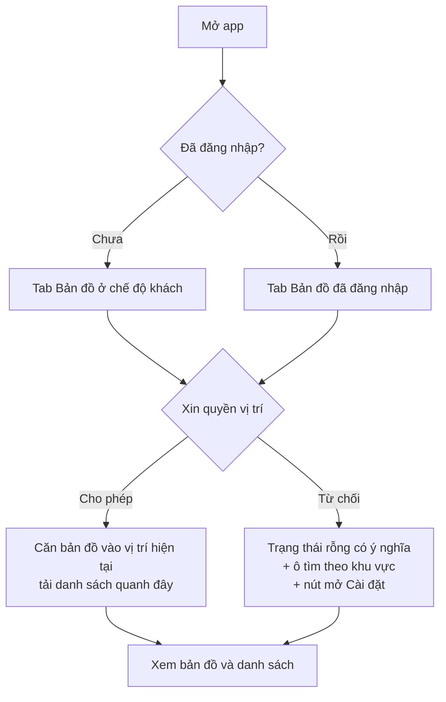
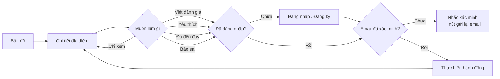
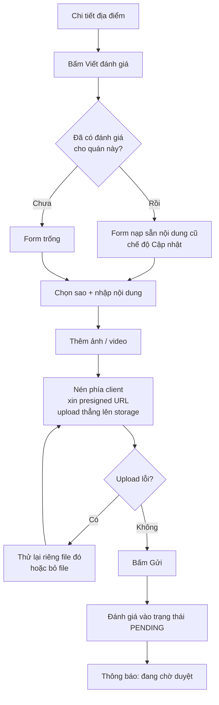
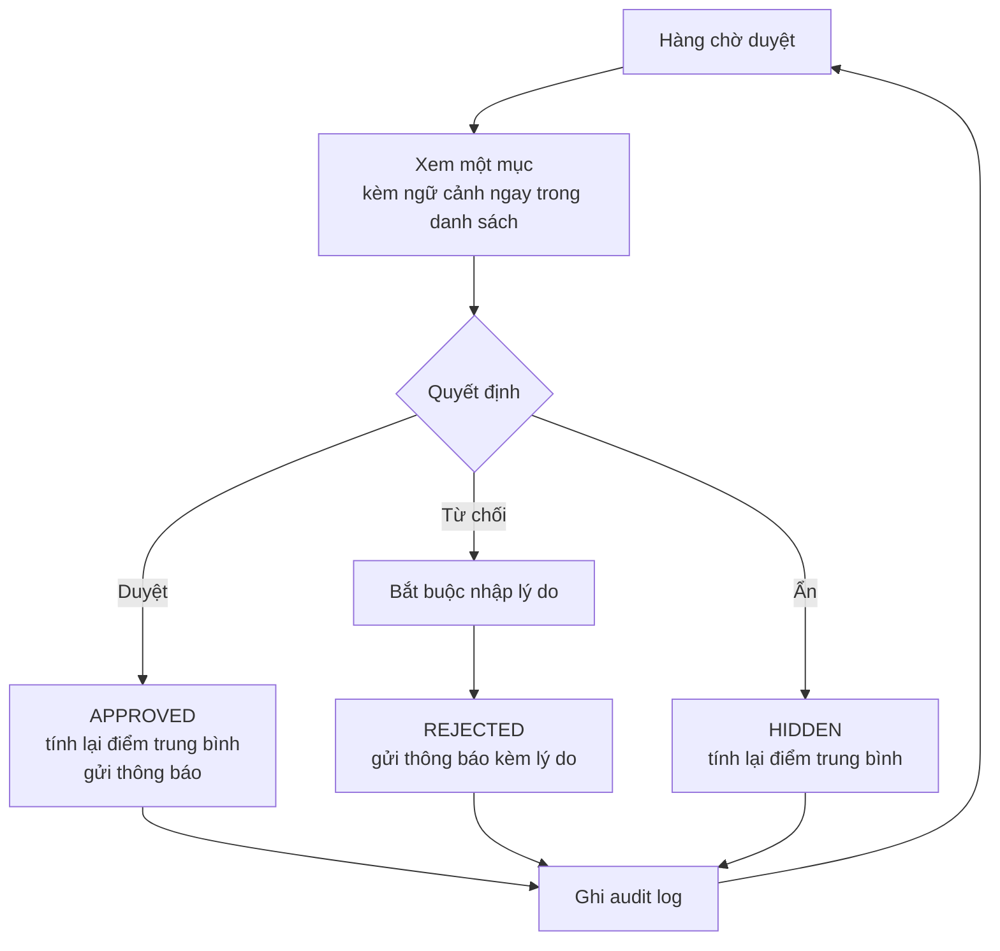
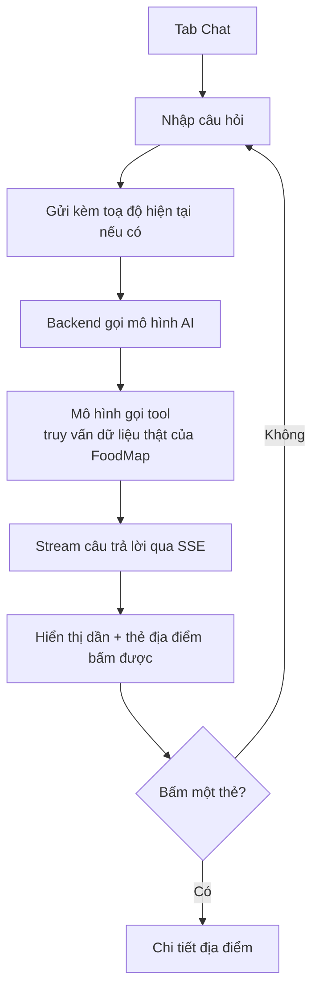

# Luồng người dùng

Các luồng chính, ở mức điều hướng. Chi tiết hành vi và luồng thay thế:
[use case](../01-srs/use-cases.md). Danh sách màn hình: [`screens.md`](./screens.md).

---

## Lần mở app đầu tiên

**Chủ ý:** khách vãng lai dùng được ngay, không có màn hình đăng nhập chắn ở đầu.
Chỉ chặn khi người dùng thật sự cần tài khoản (viết review, yêu thích, check-in).

---

## Từ khám phá tới đóng góp

**Chủ ý:** sau khi đăng nhập, quay lại **đúng chỗ đang dở**, không đẩy về màn hình chính.
Mất ngữ cảnh là lý do phổ biến khiến người dùng bỏ giữa chừng.

---

## Viết đánh giá

**Chủ ý:** upload lỗi chỉ phải làm lại **file đó**, không phải toàn bộ. Gửi thất bại
thì **giữ nguyên nội dung đã nhập** — không được để mất bài viết của người dùng.

---

## Kiểm duyệt (trang quản trị)

**Chủ ý:** ngữ cảnh (ảnh thu nhỏ, tên quán, lịch sử tác giả) hiển thị **ngay trong
danh sách**, không phải mở tab mới cho từng mục. Moderator xử lý hàng chục mục mỗi phiên.

---

## Chatbot

**Chủ ý:** stream để token đầu tiên xuất hiện trong 2 giây — chờ 10 giây nhìn màn hình
trống thì người dùng bỏ đi. Không tìm thấy thì nói thẳng, **không bịa địa điểm**.

---

## Quyết định điều hướng chung

| Tình huống | Cách xử lý |
|---|---|
| Chưa đăng nhập, chạm hành động cần tài khoản | Mở màn hình đăng nhập, **quay lại đúng chỗ** sau khi xong |
| Đã đăng nhập nhưng chưa xác minh email | Hiện nhắc nhở inline + nút gửi lại, **không** chặn cả màn hình |
| Từ chối quyền vị trí | Trạng thái rỗng có ý nghĩa + tìm theo khu vực + nút mở Cài đặt |
| Mất mạng | Hiện dữ liệu cache kèm nhãn "ngoại tuyến" + nút Thử lại |
| Không có kết quả | Nói rõ vì sao và gợi ý hành động (mở rộng bán kính, bỏ bớt bộ lọc) |
| Lỗi server | Thông báo thân thiện + nút Thử lại. **Không** hiện chi tiết kỹ thuật |
