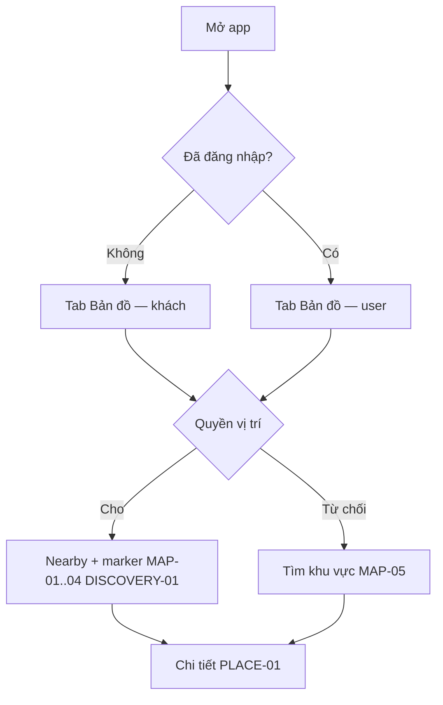
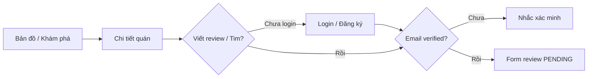
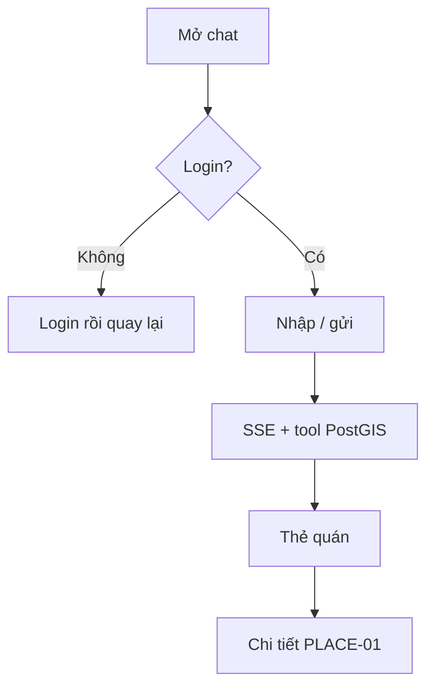
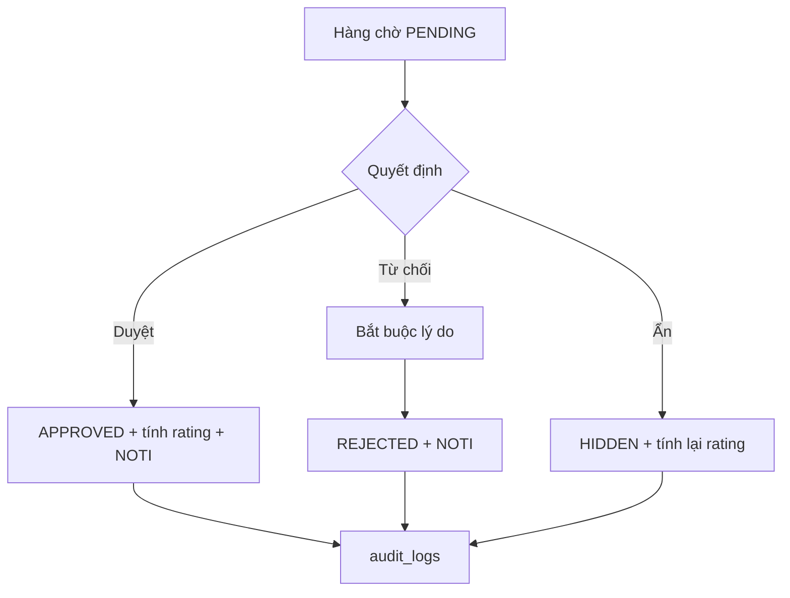

# Luồng người dùng v1

## Lần mở app

Đăng nhập **không** chắn cửa. Chỉ chặn khi bấm: viết review, yêu thích, mở chatbot, mở thông báo.

Sau login: **quay đúng màn đang dở**.

## Từ bản đồ tới đánh giá

Đã có review: form chế độ cập nhật (REVIEW-04). Upload lỗi: thử lại **từng file**.

## Chatbot

## Kiểm duyệt

