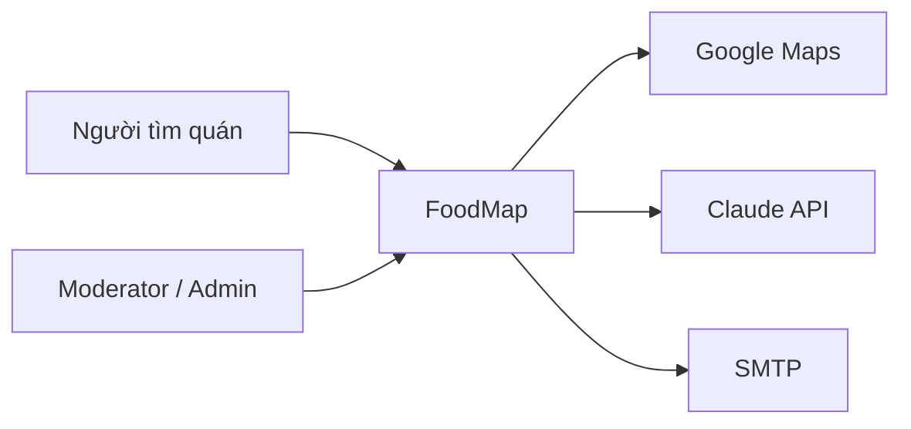
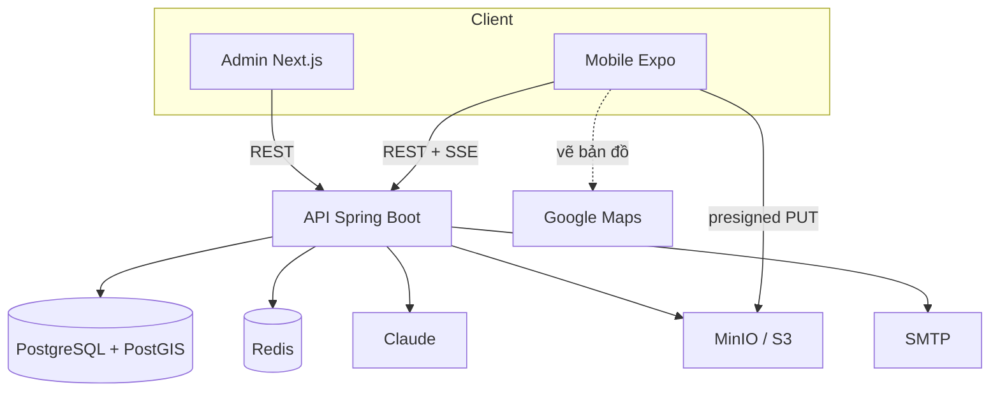

# Kiến trúc hệ thống (C4 rút gọn)

Phục vụ Feature Breakdown v1. Stack đã chọn trước: mobile Expo, backend Spring Boot 3 / Java 21, admin Next.js 15, PostgreSQL 16 + PostGIS, Redis, MinIO/S3.

## Mức 1 — Ngữ cảnh

Người tìm quán dùng mobile. Điều hành nội dung dùng trang admin. FoodMap gọi Maps để *hiển thị* bản đồ (và geocoding khi admin ghim quán), Claude để chatbot, SMTP để xác minh / quên mật khẩu.

## Mức 2 — Container

| Container | Trách nhiệm với breakdown |
|---|---|
| Mobile | MAP, DISCOVERY, PLACE, REVIEW, AUTH, AI, NOTI, LANG |
| Admin | ADMIN-*, AUTH login, LANG |
| API | Mọi luật: nearby, kiểm duyệt, JWT, tool chatbot, presigned URL |
| PostGIS | Tìm quanh đây (`ST_DWithin` + GiST). Không tính khoảng cách ở app. |
| Redis | Refresh token, rate limit login/chat |
| Object storage | Ảnh/video quán và review |

**Ranh giới**

- Hợp đồng API là `SDD/api/openapi.yaml` (cần khôi phục file đã xoá trước khi implement).
- Phân quyền chỉ có hiệu lực ở API.
- Mobile không gọi Claude trực tiếp.
- File không đi qua JVM — tránh nghẽn upload.

## Luồng dữ liệu then chốt

**Nearby:** mobile → API → `ST_DWithin` → JSON `latitude`/`longitude`/`distanceMeters` → marker.

**Upload review:** mobile → API (URL) → storage → API `confirm` (MIME, size) → gắn `review_media`.

**Chat:** mobile SSE → API → Claude → tool → PostGIS → Claude → stream. Mỗi quán có `placeId`.
